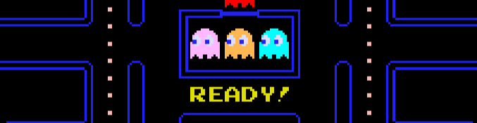

<!-- markdownlint-disable MD033 -->
<!-- markdownlint-disable MD041 -->

  

# Pac-Man

[![A project just for fun, no really!][badge-justforfunnoreally]][justforfunnoreally] ![Built with Rust][badge-built-with-rust] [![Build Status][badge-build]][build] [![Tests Status][badge-test]][test] [![Checks Status][badge-checks]][checks] [![If you're seeing this, Coveralls.io is broken again and it's not my fault.][badge-coverage]][coverage] [![Online Demo][badge-online-demo]][demo]

[badge-built-with-rust]: https://img.shields.io/badge/Built_with-Rust-blue?logo=rust
[badge-justforfunnoreally]: https://img.shields.io/badge/justforfunnoreally-dev-9ff
[badge-test]: https://github.com/Xevion/Pac-Man/actions/workflows/tests.yaml/badge.svg
[badge-checks]: https://github.com/Xevion/Pac-Man/actions/workflows/checks.yaml/badge.svg
[badge-build]: https://github.com/Xevion/Pac-Man/actions/workflows/build.yaml/badge.svg
[badge-coverage]: https://coveralls.io/repos/github/Xevion/Pac-Man/badge.svg?branch=master
[badge-online-demo]: https://img.shields.io/badge/Online%20Demo-Click%20Me!-brightgreen
[justforfunnoreally]: https://justforfunnoreally.dev
[build]: https://github.com/Xevion/Pac-Man/actions/workflows/build.yaml
[test]: https://github.com/Xevion/Pac-Man/actions/workflows/tests.yaml
[checks]: https://github.com/Xevion/Pac-Man/actions/workflows/checks.yaml
[coverage]: https://coveralls.io/github/Xevion/Pac-Man?branch=master
[demo]: https://xevion.github.io/Pac-Man/

A faithful recreation of the classic Pac-Man arcade game, written in Rust.

This project aims to replicate the original game's mechanics, graphics, sound, and behavior as accurately as possible while providing modern development features like cross-platform compatibility and WebAssembly support.

The game includes all the original features you'd expect from Pac-Man:

- [x] Classic maze navigation with tunnels and dot collection
- [ ] Four ghosts with their unique AI behaviors (Blinky, Pinky, Inky, and Clyde)
- [x] Power pellets that allow Pac-Man to eat ghosts
- [x] Fruit bonuses that appear periodically
- [ ] Progressive difficulty with faster ghosts and shorter power pellet duration
- [x] Authentic sound effects and sprites

This cross-platform implementation is built with SDL2 for graphics, audio, and input handling. It can run on Windows, Linux, macOS, even web browsers via WebAssembly.

## Quick Start

The easiest way to play is to visit the [online demo][demo]. It is more or less identical to the desktop experience at this time.

While I do plan to have desktop builds released automatically, the game is still a work in progress, and I'm not quite ready to start uploading releases.

However, every commit has build artifacts, so you can grab the [latest build artifacts][build-workflow] if available.

## Screenshots

  
  
<em>Starting a new game</em>

  
  
<em>Pac-Man collecting dots and avoiding ghosts</em>

  
  
<em>Game over screen after losing all lives</em>

  
  
<em>Debug mode showing hitboxes, node graph, and performance details.</em>

## Why?

[Just for fun.][justforfunnoreally] And because I wanted to learn more about Rust, inter-operability with C, and compiling to WebAssembly.

Originally, I was inspired by a certain code review video on YouTube; [SOME UNIQUE C++ CODE // Pacman Clone Code Review](https://www.youtube.com/watch?v=OKs_JewEeOo). For some reason, I was inspired to try and replicate it in Rust, and it was uniquely challenging. It's not easy to integrate SDL2 with Rust, and even harder to get it working with Emscripten.

I wanted to hit a lot of goals and features, making it a 'perfect' project that I could be proud of.

- Near-perfect replication of logic, scoring, graphics, sound, and behaviors. No hacks, workarounds, or poor designs. Well documented, well-tested, and maintainable.
- Written in Rust, buildable on Windows, Linux, Mac and WebAssembly. Statically linked, no runtime dependencies, automatically built with GitHub Actions.
- Performant, low memory, CPU and GPU usage.
- Online demo, playable in a browser, built automatically with GitHub Actions.

If you're curious about the journey of this project, you can read the [story](STORY.md) file. Eventually, I will be using this as the basis for some sort of blog post or more official page, but for now, I'm keeping it within the repository as a simple file.

## Roadmap

You can read the [roadmap](ROADMAP.md) file for more details on the project's goals and future plans.

## Build Notes

Since this project is still in progress, I'm only going to cover non-obvious build details. By reading the code, build scripts, and copying the online build workflows, you should be able to replicate the build process.

- Install `cargo-vcpkg` with `cargo install cargo-vcpkg`, then run `cargo vcpkg build --manifest-path pacman/Cargo.toml` to build the requisite dependencies via vcpkg.
  - `--manifest-path` is only required if you run it from the root directory; you can omit it if you `cd` into the `pacman` directory first.
  - This is only required for the desktop builds, not the web build.
- We use rustc 1.86.0 for the build, due to bulk-memory-opt related issues on wasm32-unknown-emscripten.
  - Technically, we could probably use stable or even nightly on desktop targets, but using different versions for different targets is a pain, mainly because of clippy warnings changing between versions.
- For the WASM build, you need to have the Emscripten SDK cloned; you can do so with `git clone https://github.com/emscripten-core/emsdk.git`
  - The first time you clone, you'll need to install the appropriate SDK version with `./emsdk install 3.1.43` and then activate it with `./emsdk activate 3.1.43`. On Windows, use `./emsdk/emsdk.ps1` instead.
    - I'm still not sure _why_ 3.1.43 is required, but it is. Perhaps in the future I will attempt to use a more modern version.
    - Occasionally, the build will fail due to dependencies failing to download. I even have a retry mechanism in the build workflow due to this.
  - You can then activate the Emscripten SDK with `source ./emsdk/emsdk_env.sh` or `./emsdk/emsdk_env.ps1` or `./emsdk/emsdk_env.bat` depending on your OS/terminal.
  - While using the `web.build.ts` is not technically required, it simplifies the build process and is very helpful.
    - It is intended to be run with `bun`, which you can acquire at [bun.sh](https://bun.sh/)
  - Tip: You can launch a fileserver with `python` or `caddy` to serve the files in the `dist` folder.
    - `python3 -m http.server 8080 -d dist`
    - `caddy file-server --root dist` (install with `[sudo apt|brew|choco] install caddy` or [a dozen other ways](https://caddyserver.com/docs/install))
- `web.build.ts` auto installs dependencies, but you may need to pass `-i` or `--install=fallback|force` to install missing packages. My guess is that if you have some packages installed, it won't install any missing ones. If you have no packages installed, it will install all of them.
  - If you want to have TypeScript resolution for development, you can manually install the dependencies with `bun install` in the `assets/site` folder.

## Contributing

Contributions are welcome! Please feel free to submit a pull request or open an issue.

- The code is not exactly stable or bulletproof, but it is functional and has a lot of tests.
- I am not actively looking for contributors, but I will review pull requests and merge them if they are useful.
- If you have any ideas, please feel free to submit an issue.
- If you have any private issues, security concerns, or anything sensitive, you can email me at [xevion@xevion.dev](mailto:xevion@xevion.dev).

## License

This project is licensed under the GPLv3 license. See the [LICENSE](LICENSE) file for details.

[build-workflow]: https://github.com/Xevion/Pac-Man/actions/workflows/build.yaml
